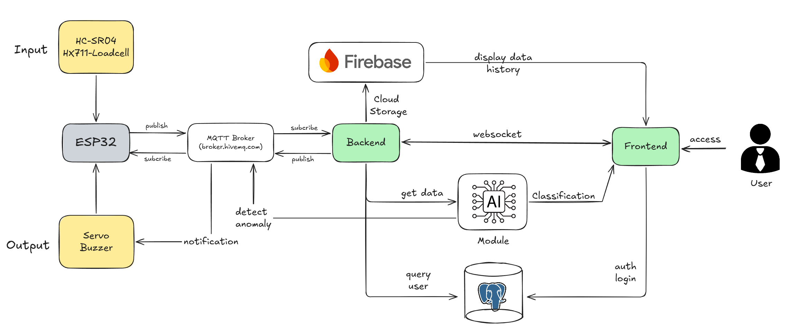
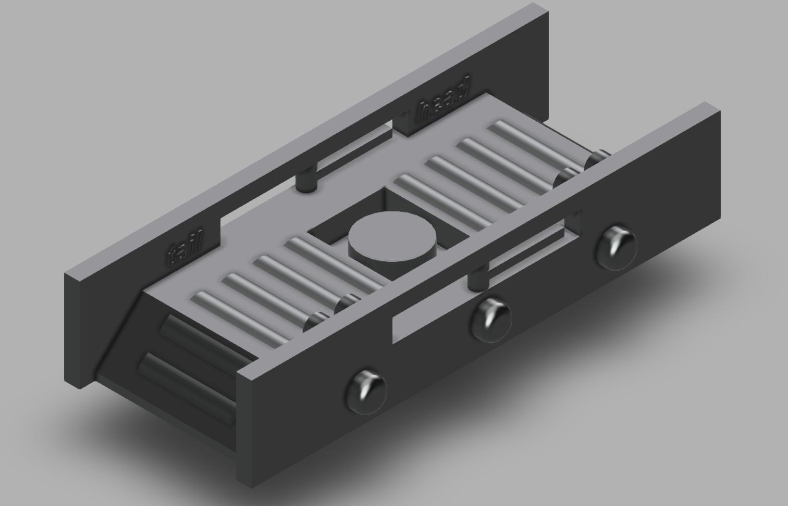
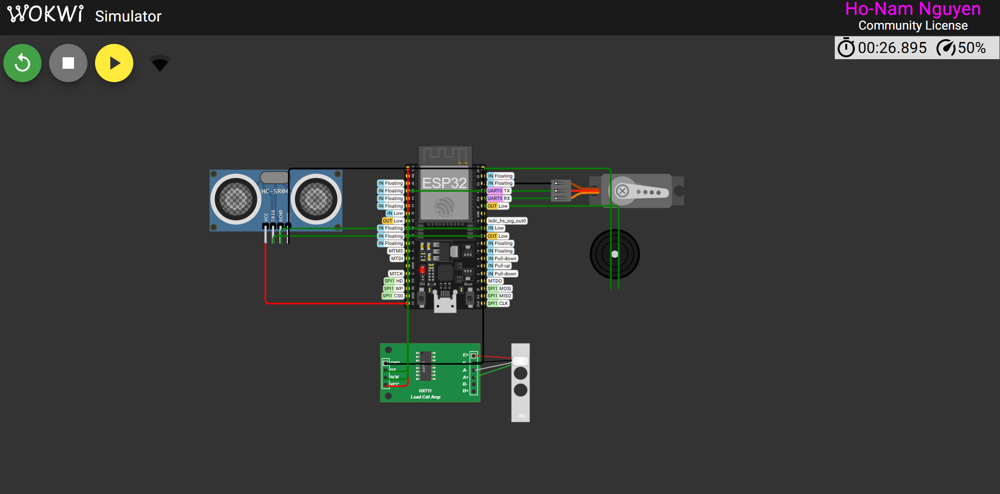
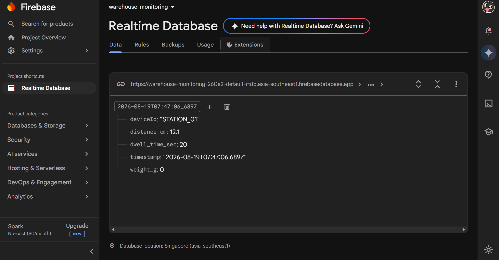
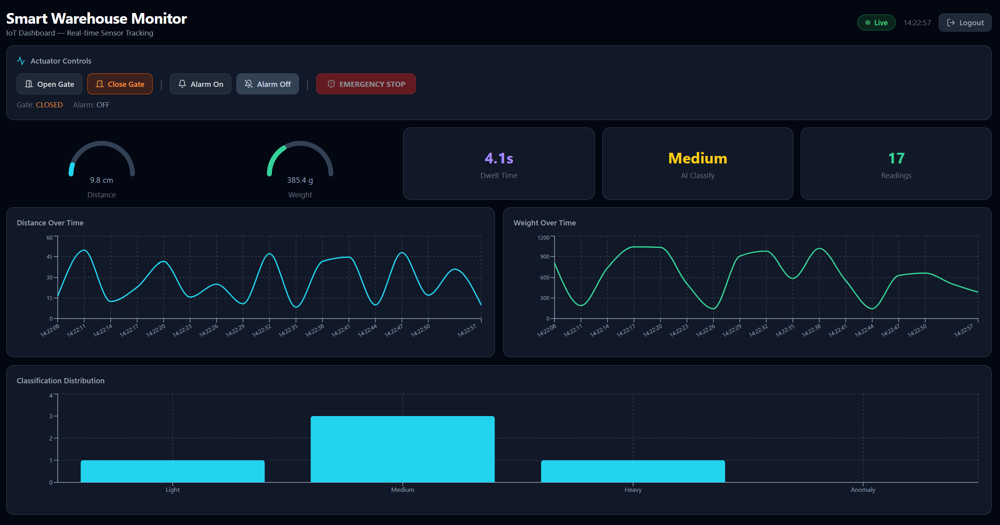

# Smart Warehouse Monitoring System

An IoT-based smart warehouse monitoring and automated goods sorting system. PHY00007 Project - Internet of Things

## System Overview




## Quick Start (Local)

```bash
# 1. PostgreSQL (via Docker, or local install)
docker compose up -d db

# 2. Backend
cd backend && npm install && node server.js

# 3. Frontend
cd frontend && npm install && npm run dev

# 4. AI Module
cd ai-module && pip install -r requirements.txt && python main.py

# 5. Simulator (optional — for testing without Wokwi)
pip install paho-mqtt && python tools/mqtt_sim.py
```

Open `http://localhost:5173` → register/login → dashboard.

## Quick Start (Docker)

```bash
docker compose up --build
# Frontend: http://localhost
# Backend:  http://localhost:4000
```
<table>
  <tr>
    <td align="center"><b>3D Model</b><br></td>
    <td align="center"><b>Wokwi Simulation</b><br></td>
  </tr>
</table>

## Advanced Features Setup

### Discord Instant Notifications

Sends real-time alerts to a Discord channel when the AI detects an anomaly.

**Setup:**
1. Discord → Server Settings → Integrations → Webhooks → New Webhook
2. Copy Webhook URL → add to `.env`:
   ```
   DISCORD_WEBHOOK_URL=https://discord.com/api/webhooks/xxx/yyy
   ```
3. Run simulator → AI detects anomaly → Discord channel receives red embed alert
4. Install Discord mobile app + enable channel notifications for push alerts on phone

**Test:** `python tools/anomaly_sim.py` — sends payloads triggering OVERLOAD and SENSOR FAULT

---

### Scheduled Email Reports

Automatically sends shift summary reports via email every N hours.

**Setup:**
1. Enable 2-Step Verification on your Google account
2. Generate App Password: https://myaccount.google.com/apppasswords → name it `Warehouse` → copy 16-char password
3. Add to `.env`:
   ```
   EMAIL_USER=your_email@gmail.com
   EMAIL_PASS=xxxx xxxx xxxx xxxx
   EMAIL_TO=recipient@example.com
   REPORT_CRON=*/2 * * * *        # every 2 min for testing
   ```
4. Run simulator to accumulate readings
5. Wait for cron trigger → check inbox for `[Warehouse Report] Shift Summary`

**Quick test:** `curl -X POST http://localhost:4000/api/report/send` or Discord `!send_report`

**Cron examples:**
| Expression | Schedule |
|-----------|----------|
| `*/2 * * * *` | Every 2 minutes (test) |
| `0 */2 * * *` | Every 2 hours |
| `0 8,17 * * *` | 8 AM & 5 PM daily |

---

### Discord Chatbot Commands

Interactive bot that responds to commands in a Discord channel.

**Setup:**
1. https://discord.com/developers/applications → New Application → name it `Warehouse Bot`
2. Bot → Add Bot → Reset Token → copy token
3. OAuth2 → URL Generator → tick `bot` + `Send Messages` + `Read Messages` + `Read Message History`
4. Copy generated URL → open in browser → invite bot to your server
5. Discord Settings → Advanced → enable Developer Mode
6. Right-click target channel → Copy Channel ID
7. Add to `.env`:
   ```
   DISCORD_BOT_TOKEN=MTMxMjM0NTY3ODkw...
   DISCORD_CHANNEL_ID=123456789012345678
   ```
8. Restart Backend → log `[DiscordBot] Logged in as Warehouse Bot#xxxx`

**Commands:**
| Command | Description |
|---------|-------------|
| `!help` | Show command list |
| `!status` | Current sensor readings + AI status (embed) |
| `!report` | Shift stats summary (embed) |
| `!send_report` | Trigger email report immediately |
| `!open_gate` | Open sorting gate via MQTT |
| `!emergency_stop` | Close gate + activate alarm |

---

### Core Features

#### Input 1 — Ultrasonic Distance Sensor (HC-SR04)
— Reads object distance via HC-SR04 ultrasonic sensor. Data flows: ESP32 → MQTT (`warehouse/sensors`) → Backend → Firebase + Socket.io → Frontend Dashboard. The Distance Gauge and Line Chart update in real-time.

#### Input 2 — Weight Sensor (Loadcell + HX711)
— Reads object weight via Loadcell with HX711 ADC. Data flows through the same MQTT pipeline: ESP32 → MQTT → Backend → Frontend. Weight Gauge and Line Chart update in real-time. EMA filter applied on firmware for noise reduction.

#### Output — Actuator Control (Servo SG90 + Buzzer)
— Dashboard UI buttons (Open Gate, Close Gate, Alarm On/Off, Emergency Stop) emit Socket.io events → Backend → MQTT (`warehouse/actuators`) → ESP32 → Servo rotates to sort goods, Buzzer sounds on alarm. Gate and Alarm status displayed on Dashboard.

#### Firebase Realtime Database (Cloud Storage)
— All sensor readings stored in Firebase RTDB as time-series at `sensors/{deviceId}/{timestamp}`. Frontend loads historical data from Firebase on initial page load to populate charts (LineChart + BarChart), then continues with real-time Socket.io updates.


#### Recharts Visualization (Dashboard Charts)
— Three Recharts components on Dashboard:
- **LineChart — Distance Over Time**: last 30 distance readings
- **LineChart — Weight Over Time**: last 30 weight readings
- **BarChart — Classification Distribution**: counts of Light / Medium / Heavy / Anomaly classified items

#### PostgreSQL Authentication & Security
— User registration and login with bcrypt password hashing (12 salt rounds). JWT Bearer token authentication. User accounts stored in PostgreSQL `users` table. Protected routes on frontend via `ProtectedRoute` component. Login and Register pages built with React.

#### Fullstack Web Server
— Custom-built web application without NodeRED:
- **Backend**: Node.js + Express + Socket.io + MQTT client
- **Frontend**: React + Vite + Tailwind CSS + Recharts
- **Auth**: JWT middleware protecting API routes
- **Real-time**: Socket.io for live sensor data and actuator commands
##### Web Dashboard

---

### AI/DS Microservice

Real-time anomaly detection using Welford's online algorithm + Z-score.

**Endpoints:**
| Method | Path | Description |
|--------|------|-------------|
| `GET` | `/` | Health check |
| `POST` | `/predict` | Classify cargo + detect anomalies |
| `GET` | `/stats` | Current learned statistics (mean, std) |
| `POST` | `/reset-stats` | Reset baseline for fresh testing |

**How it works:**
1. Receives `{weight_g, distance_cm, dwell_time_sec}` from Backend
2. Classifies cargo: Light (< 250g), Medium (250-750g), Heavy (> 750g)
3. Detects anomalies: OVERLOAD (> 1200g), SENSOR FAULT (negative values), statistical outliers (|z| > 2.5σ)
4. Updates running mean/std with each valid reading (online learning)
5. Persists learned stats to `ai-module/stats_cache.json` across restarts

---

## Environment Variables

See `.env.example` for full documentation. Key variables:

| Variable | Purpose |
|----------|---------|
| `DISCORD_WEBHOOK_URL` | Discord alert webhook |
| `DISCORD_BOT_TOKEN` | Discord chatbot token |
| `DISCORD_CHANNEL_ID` | Discord channel for chatbot |
| `EMAIL_USER` / `EMAIL_PASS` | Gmail SMTP credentials |
| `REPORT_CRON` | Cron expression for scheduled reports |
| `FIREBASE_DATABASE_URL` | Firebase Realtime DB URL |
| `AI_SERVICE_URL` | AI microservice URL (default: `http://localhost:8000`) |

---

## Testing Tools

```bash
# Normal sensor simulation (every 3s)
python tools/mqtt_sim.py

# Anomaly simulation (for testing ID 6 & ID 7)
python tools/anomaly_sim.py

# Wokwi hardware simulation
cd firmware && wokwi-cli
```