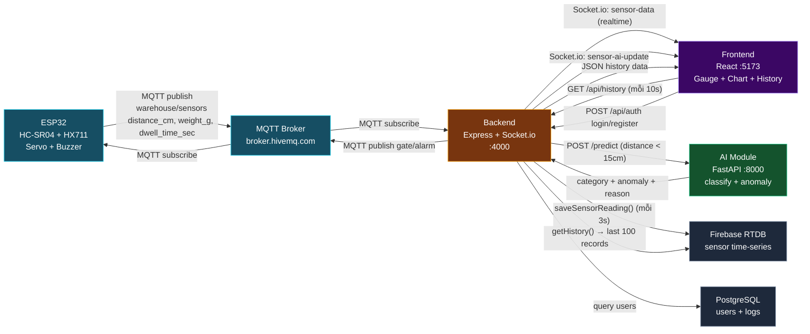

# System Data Flow Diagram

## 3 Data Flows

| # | Flow | Đường đi | Mục đích |
|---|---|---|---|
| 1 | **Real-time** | ESP32 → MQTT → Backend → Socket.io → Frontend | Gauge + Chart update ngay |
| 2 | **AI** | Backend → AI /predict → Backend → Frontend | Phân loại + phát hiện bất thường |
| 3 | **History** | Firebase ← Backend (save) / Firebase → Backend → Frontend (fetch) | Lưu trữ + hiển thị lịch sử |
